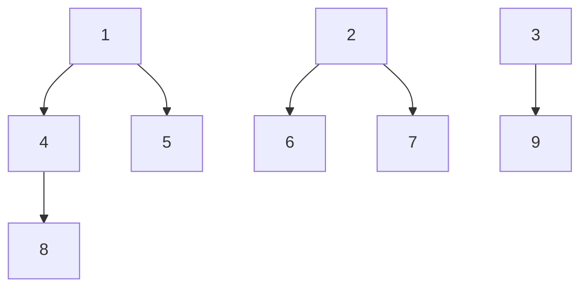
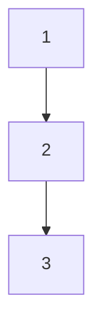

## 카테고리 기능 구현
- [] 카테고리 추가
- [] 카테고리 조회
- [] 카테고리 수정
- [] 카테고리 삭제

## 카테고리는 클로저 테이블로 구현
> ## 클로저 테이블?
> |부모|자식|깊이|
> - | 1 | 1 | 0 |
> - | 2 | 2 | 0 |
> - | 3 | 3 | 0 |
> - | 1 | 4 | 1 |
> - | 4 | 4 | 0 |
> - | 1 | 5 | 1 |
> - | 5 | 5 | 0 |
> - | 2 | 6 | 1 |
> - | 6 | 6 | 0 |
> - | 2 | 7 | 1 |
> - | 7 | 7 | 0 |
> - | 4 | 8 | 1 |
> - | 1 | 8 | 2 |
> - | 8 | 8 | 0 |
> - | 3 | 9 | 1 |
> - 
> - 
> - 위와 같은 테이블 형식을 갖는다
> - 트리 구조의 모든 노드쌍 관계를 저장한다.
> 

- 추가 요청시 깊이와 부모를 파라미터로 받는다.
- 테이블은 먼저 파라미터로 온 부모와의 관계를 삽입
- | 부모 | 자식 | 깊이 |
- 이후 부모의 부모 테이블을 찾는다.
- | 조상 | 자손 | 부모 |
- 이 과정을 루트노드까지 반복한다.
#
#

### 최상위 카테고리 조회
- 깊이가 0인 카테고리 모두 조회
### 1번 하위의 카테고리 조회
- 깊이가 1이면서 부모가 1인 카테고리 모두 조회
### 1번 하위의 2번 카테고리 조회
- 깊이가 2 이면서 2번이 부모인 카테고리 모두 조회
#

### 카테고리 삽입
- 삽입 시 부모, 자식, 깊이를 파라미터로 받는다
- > | 2 | 3 | 1 |
- 위와같이 삽입 될 경우 2번 하위에 3번 카테고리가 존재한다 깊이는 2이다
- 다음으로 2번의 부모가 존재하는지 확인후 존재할 경우 부모의 부모도 삽입한다
- > | 1 | 3 | 2 |
- 1이 0번째 최상위 카테고리 이므로 부모카테고리 삽입은 끝
- > | 3 | 3 | 0 |
- 마지막으로 자기 자신도 삽입한다.\

### 카테고리 삭제
- 삭제하려는 카테고리를 부모로 갖는 모든 테이블 조회
- 그 테이블들의 모든 자식 카테고리 삭제
- 삭제 하려는 카테고리를 부모로 갖는 모든 카테고리 삭제

- 관계도는 위와 같다.
#

- 카테고리 업데이트는 [ProductCategoryUpdateRequestDto.java](db%2Fdto%2Frequest%2FProductCategoryUpdateRequestDto.java) 를 사용한다
- 